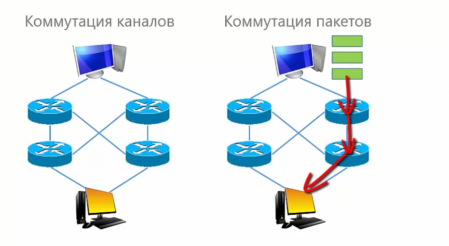

# Классификация сетей

<kbd>

 

 

### Коммутация каналов и пакетов

Коммутация каналов используется в телефонной сети.

Коммутация пакетов - в компьютерных сетях. Данные делятся на пакеты, передаются отдельно, независимо друг от друга и могут проходить разным путем. Преимущество коммутации пакетов является отказоустойчивать. При выходе из строя одного из узлов можно найти другой путь.

 

 

### Задача маршрутизации

При поступлении пакета на промежуточный узел необходимо решать задачу маршрутизации - определять куда дальше направлять этот пакет. Задача маршрутизация должна решаться отдельно для каждого пакета на каждом промежуточном устройстве. Это требует время и создает вычислительную нагрузку.

 

 

### Технология передачи

 

 

 

 

 

 

<kbd>
 

