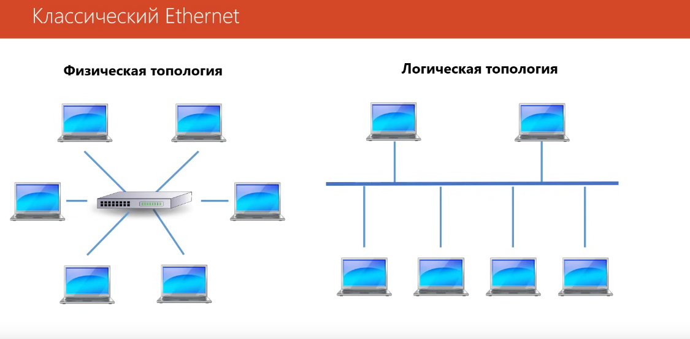

# Топология сетей

- Полносвязная топология
- Топология звезда
- Кольцо
- дерево
- общая шина

Различия физической и логической топологии:
Физическая - определяет соединения устройств в сети
ЛОгическая - правила распространения сигналов в сети.

В классическом представлении используется топология звезда - физическая, а внутри коммутатора уже используется логика, где каждый ПК может быть соединен друг с другом.

