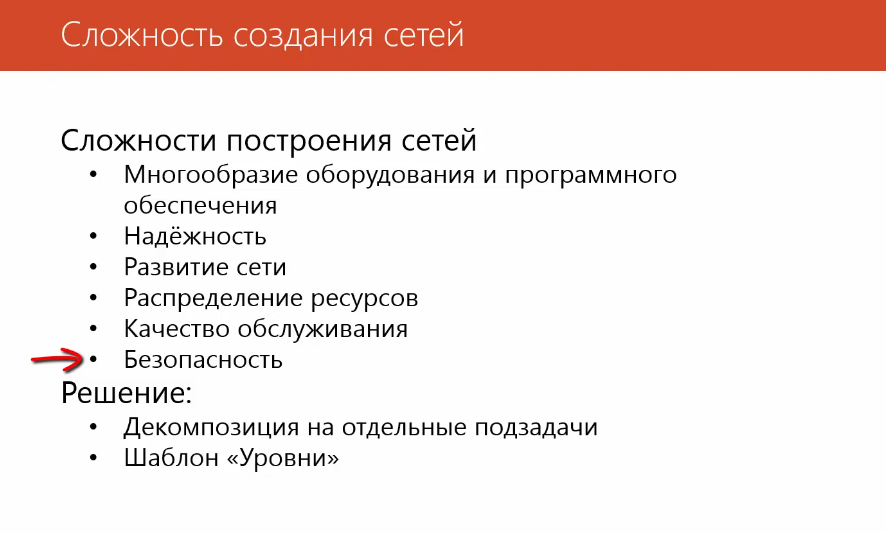
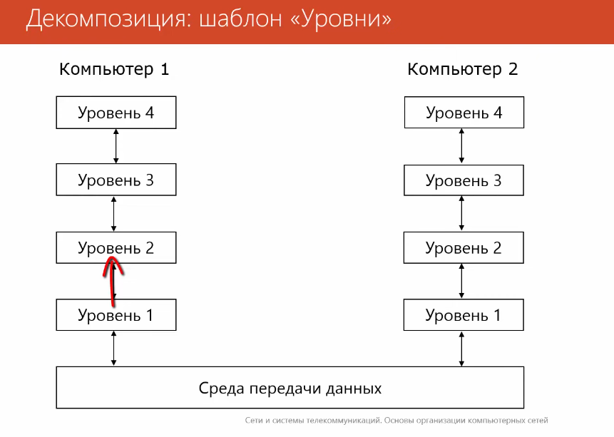
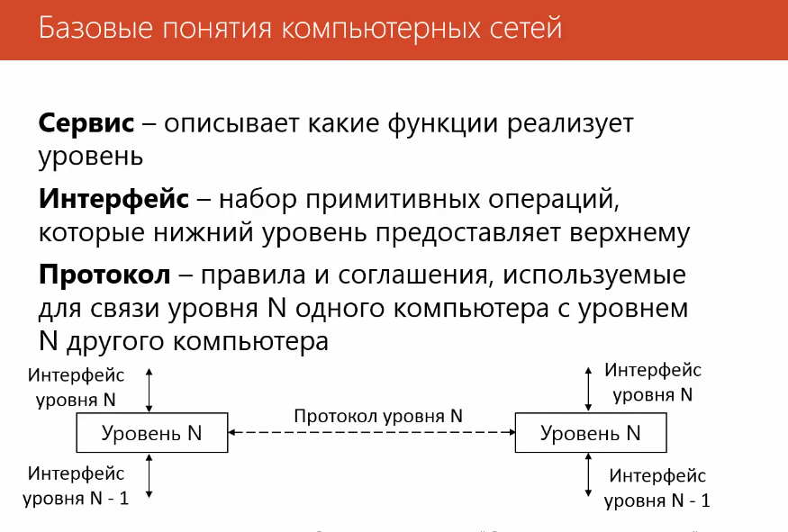
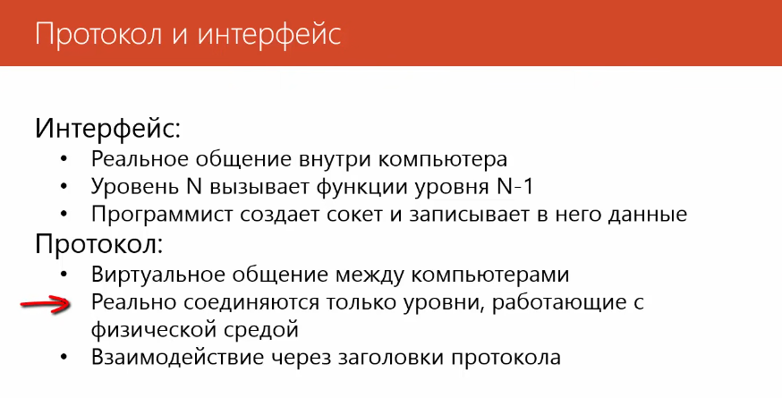
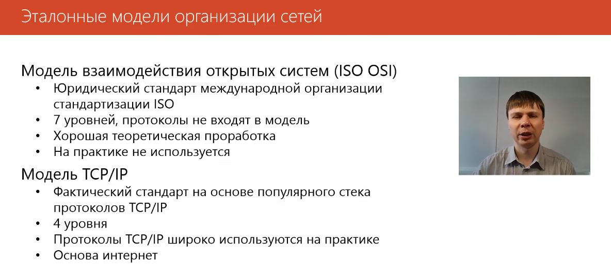
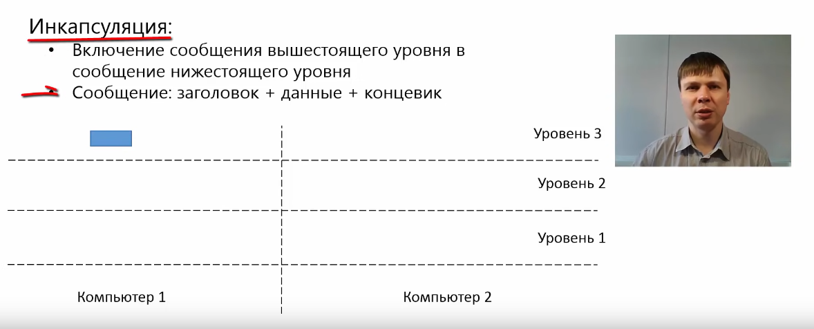
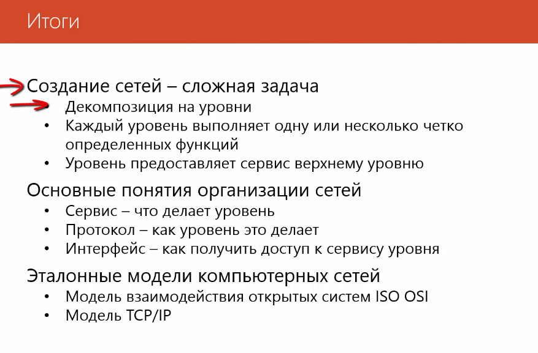

# Основы организации сетей

Сервис определяет как будут обмениваться данных приложения или как будет осуществляться поиск маршрута.

 ### Инкапсуляция
 Комментарии к инкапсуляции в порядке последовательности операций от ПК1 к ПК2:
1. 3-й уровень сети формирует сообщение и передает его на 2 уровень
2. 2-й уровень разбивает сообщение на 2 части и добавляет к сообщению заголовок 2 уровня.
3. В таком виде 2 сообщения передаются на 1 уровень сети. Первый уровень добавляет заголовок и т.к. этот этот уровень непосредственно взаимодействует со средой передачи данных, добавляет концевик. Таким образом:
сообщение, которое передается по сети соостоит:
- заголовк первого уровня
- данные первого уровня
- концевик

Но, внутри того, что первый уровень считает данными находятся заголовки 2рого уровня и 3го уровня.

Сообщение по среде передачи данных передаются на ПК 2:
- первый уровень получает сообщение, удаляет заголовки и концевики и передает сообщение в таком виде на второй уровень
- второй уровень удаляет заголовки, объединяет сообщения и передает на 3уровень
- 3-й уровень извлекает полезные данные и передает приложениям.

