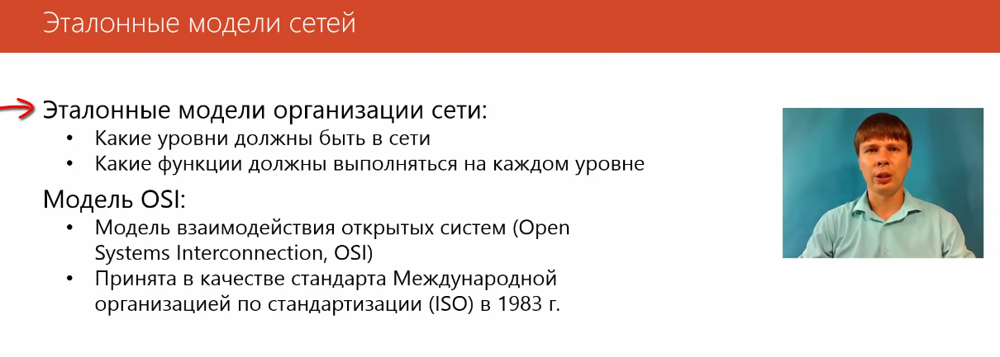
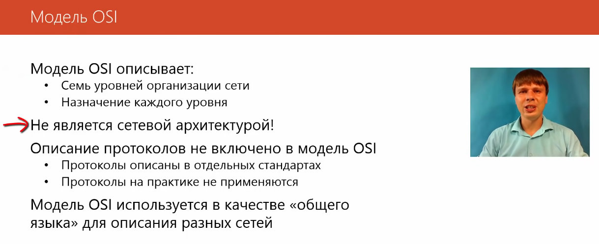
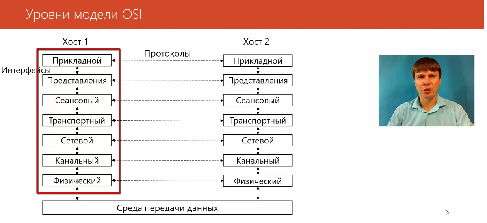
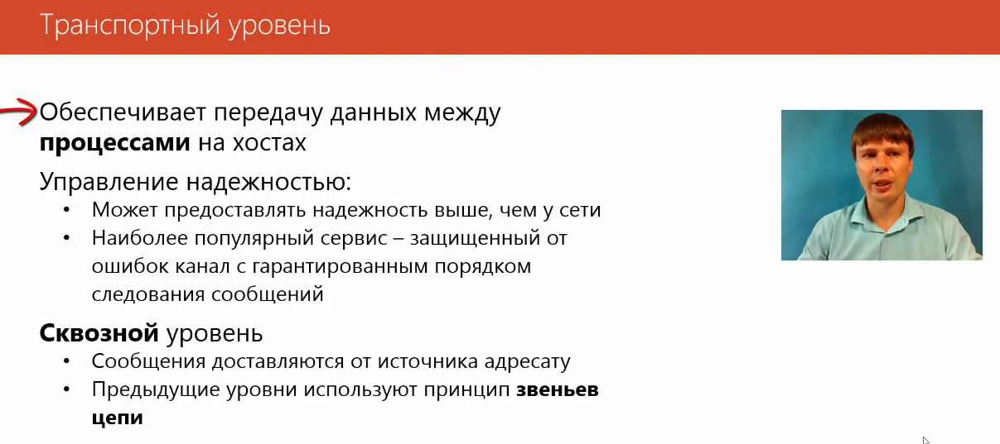
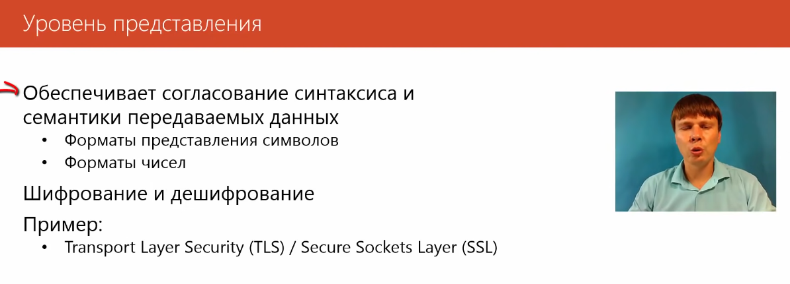
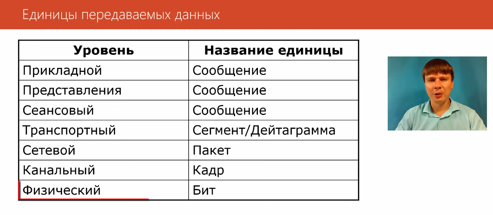
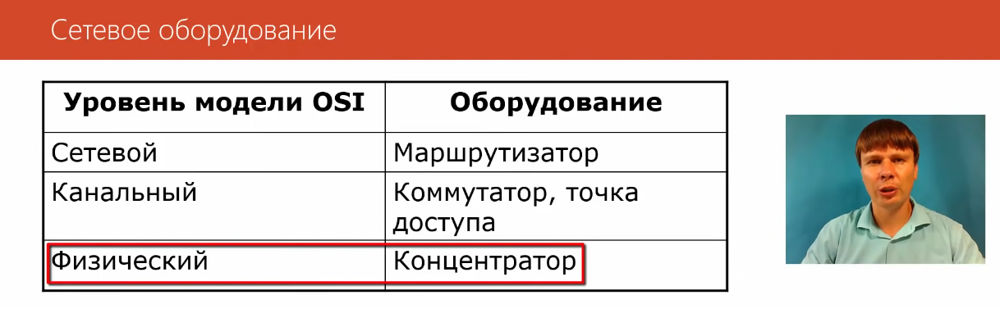
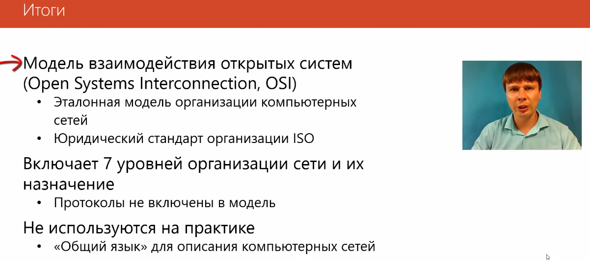

# Модель OSI

На практике модель OSI не используется, однако ее достоинством является хорошая теоретическакая проработка вопроса. 

__ОДНАКО НА ПРАКТИКЕ СЕАНСОВЫЙ УРОВЕНЬ НЕ ИСПОЛЬЗУЕТСЯ!__

