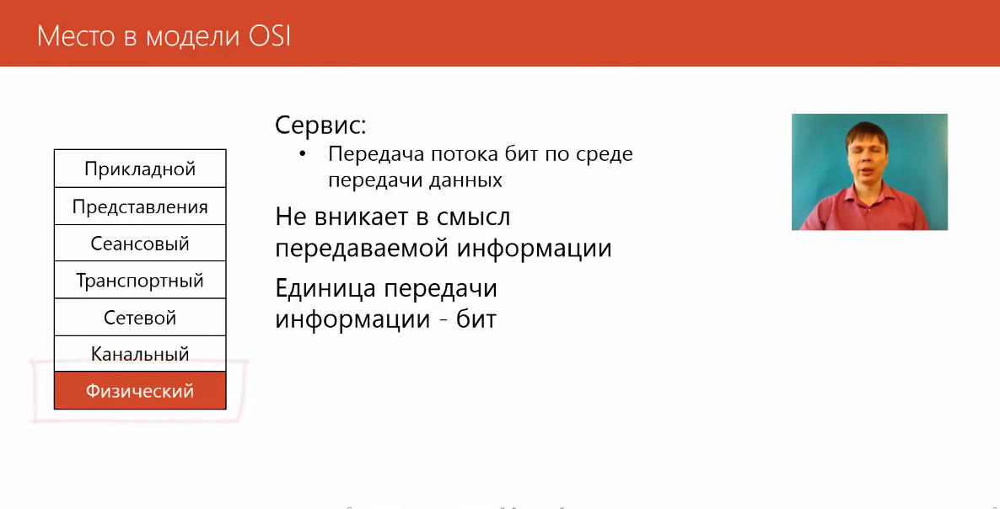
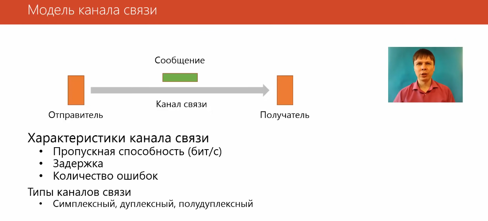
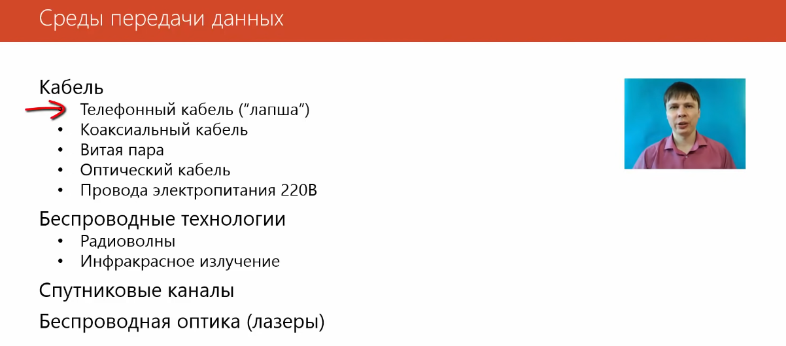
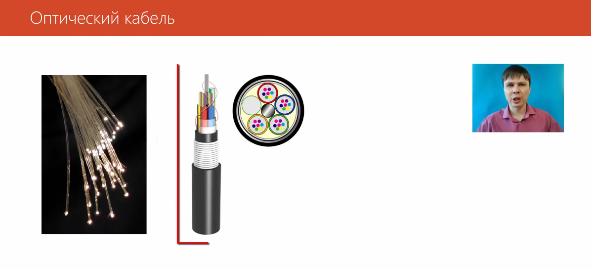
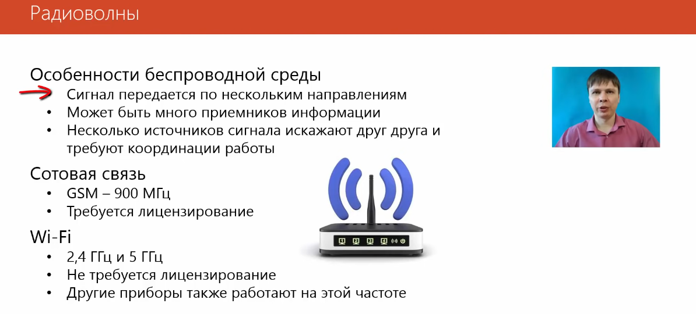
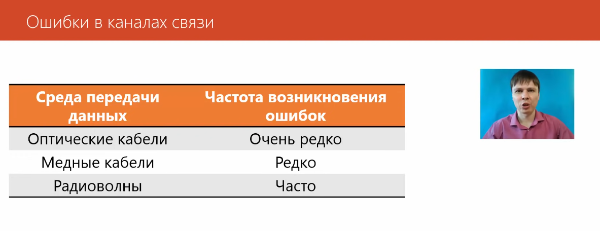
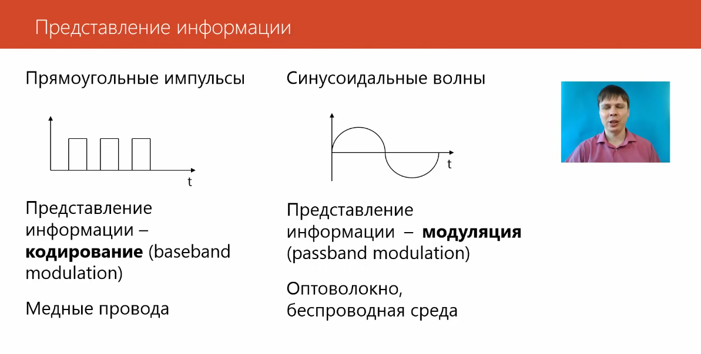
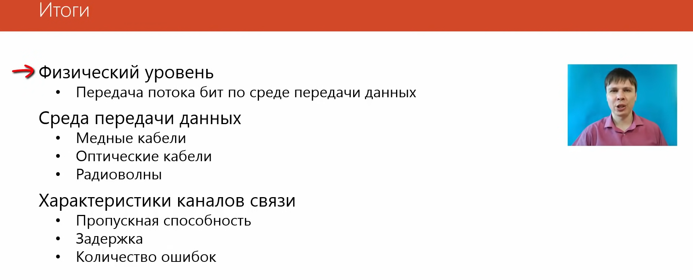

# Физический уровень

Симплексный - в одну сторону
Дуплексный - можно передавать данные в обе стороны одновременно
Полудуплексный - поочередно

Кабель витая пара скручен между собой для того, чтобы меньше создавалось помех

